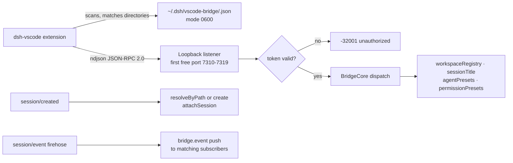

# dsh-vscode-bridge

[中文](README.md) | English

A plugin for [DeepSeek Harness](https://github.com/deepseek-ai/deepseek-harness) (DSH) that gives the [dsh-vscode-lite](https://github.com/EPCN-fla/dsh-vscode-lite) a narrow, token-authenticated JSON-RPC channel into native DSH services — workspace grouping, session titles, session archive, agent presets, and permission presets.

The ACP surface is automation-only: titles, deletion, workspace grouping, presets, and permission modes never cross the ACP wire. With this plugin loaded, the extension talks to the harness's own services directly.

## Why

Sessions created over ACP never join the workspace registry, so the DSH Web UI files them under "ungrouped". Renaming or deleting a session, switching an agent preset, or flipping the permission mode all have native DSH services behind them — but nothing exposes those services to an external client.

This plugin closes that gap from inside the harness process: a loopback TCP listener with a bearer token discovered through a file the extension can actually find.

## Features

- **Workspace grouping fix**: every newly created session is attached to the workspace owning its cwd on `session/created` (creating the workspace when missing) — the "ungrouped" bucket stops filling up.
- **Native session titles**: read the folded title of any session, rename any live session through `sessionTitle.rename`.
- **Session delete**: product-level deletion through the registry-wide archive set (`workspaceRegistry.archiveSession`).
- **Agent presets**: list the roster with the effective default, read a session's composed preset, switch blank sessions (`agent-preset/locked` once a turn has run — upstream contract).
- **Permission presets**: query the option list plus a session's current preset, and switch it — sandbox mode and approval policy follow immediately.
- **Event push**: subscribed clients receive `bridge.event` notifications for plan/todo/title/permission session events, with exact or prefix (`plan/`) type filters.
- **Honest capabilities**: `bridge.handshake` reports what this deployment can actually do; a missing optional service degrades one method family, never the whole plugin.

## How it works



1. The plugin binds the first free port in its configured range, so several harness processes (one per editor window) coexist without coordination.
2. It publishes `{ port, token, pid, protocolVersion, capabilities, directories }` as `$HOME/.dsh/vscode-bridge/<pid>.json` (mode 0600, atomic write); `directories` lists the process cwd, every live session cwd, and every known workspace path so the extension can match its instance. The file is removed on unload, and stale entries are reaped on startup via pid liveness. Workspace directories are no longer written to.
3. Every request carries the token in a top-level `token` field; loopback plus file permissions are the whole access boundary.
4. WSL2's `localhostForwarding` lets a Windows-side extension reach a WSL-side listener transparently.

## Install

Requires deepseek-harness **0.1.5-rc.2** (`@deepseek-ai/dsh-*` packages ≥ 0.1.5-rc.2).

The plugin must be loaded into a custom profile carrying both the `dsh-base` and `dsh-acp-app` bundles. DSH ships no ready-made acp profile: a custom profile initialized by `dsh plugin` starts with `dsh-base` only, so you add the `dsh-acp-app` bundle by hand, plus the service rows the ACP composition does not ship (`workspace`, `agent-presets`, and the subagent model-route host row the `standard` preset mounts).

### From npm

```sh
# A missing profile is initialized on the spot (with the dsh-base bundle only).
dsh plugin --profile acp-vscode add dsh-vscode-bridge
```

### From tarball

```sh
git clone <this repository>
cd dsh-vscode-bridge
pnpm install
pnpm run build
pnpm pack       # produces dsh-vscode-bridge-<version>.tgz
dsh plugin --profile acp-vscode add ./dsh-vscode-bridge-<version>.tgz
```

### Local development

Point the CLI at a working copy; rebuild after each change:

```sh
dsh plugin --profile acp-vscode add /absolute/path/to/dsh-vscode-bridge
```

### Wire up the profile

First add the ACP app to the bundle list in `$DSH_HOME/profiles/acp-vscode/package.json` (bundles ship with the CLI installation; nothing extra to download):

```json
{
  "dsh": {
    "profile": {
      "bundles": ["@deepseek-ai/dsh-base", "@deepseek-ai/dsh-acp-app"]
    }
  }
}
```

Then register the plugin and the missing service rows in `cordis.patch.yml` next to it:

```yaml
# Insert the rows the ACP composition does not ship.
- insert:
    - id: workspace
      name: '@deepseek-ai/dsh-workspace'
    - id: agent-presets
      name: '@deepseek-ai/dsh-agent-presets'
      config:
        default: standard
    # The standard preset's subagent model routes read this host row
    # (shipped by the web bundle, absent from the ACP composition).
    - id: subagent-model-selection-settings
      name: '@deepseek-ai/dsh-tool-subagent/model-selection-settings'
    - id: dsh-vscode-bridge
      name: 'dsh-vscode-bridge'
      # config: { portStart: 7310, portEnd: 7319 }   # optional overrides

# Optional: add display names and descriptions to the three permission
# states (the base table carries only sandbox/approval, no name/description
# metadata).
- id: permission
  config:
    presets:
      read-only:
        sandbox: read-only
        approval: ask
        name: read-only
        description: Read-only; writes and wider retries require approval.
      workspace-write:
        sandbox: workspace-write
        approval: ask
        name: workspace-write
        description: Write inside the workspace; wider retries require approval.
      danger-full-access:
        sandbox: danger-full-access
        approval: never
        name: danger-full-access
        description: Full file access without approval prompts.
```

Finally point the extension at the profile by setting `dsh.profile` to `acp-vscode` (the extension's one-click install automates the whole sequence).

## Wire protocol

One JSON object per line, both directions, standard JSON-RPC 2.0 envelope.

```jsonc
// request
{ "jsonrpc": "2.0", "id": 1, "method": "session.setTitle",
  "params": { "sessionId": "…", "title": "Fix auth flow" }, "token": "…" }
// success
{ "jsonrpc": "2.0", "id": 1, "result": { "sessionId": "…", "title": "Fix auth flow", "updatedAt": 1700000000500 } }
// failure (data.code is stable machine-readable detail)
{ "jsonrpc": "2.0", "id": 1, "error": { "code": -32009, "message": "session \"…\" has already started; its agent preset is fixed",
  "data": { "code": "agent-preset/locked", "details": { } } } }
```

| Method | Params | Result |
|---|---|---|
| `bridge.handshake` | — | `{ protocolVersion, plugin, version, pid, startedAt, capabilities }` |
| `session.list` | `{ includeStored? }` | `{ sessions: LiveSessionInfo[], storedIncluded, stored? }` |
| `session.get` | `{ sessionId }` | live row, or a stored row with the folded title |
| `session.setTitle` | `{ sessionId, title }` | `{ sessionId, title, updatedAt }` — live sessions only |
| `session.delete` | `{ sessionId }` | `{ sessionId, archived: true }` |
| `session.subscribe` | `{ sessionId?, types? }` | `{ subscribed: true, types }`; events arrive as `bridge.event` notifications |
| `session.unsubscribe` | — | `{ subscribed: false }` |
| `preset.list` | — | `{ default, presets: [{ id, trust, name?, description?, broken?, isDefault }] }` |
| `preset.current` | `{ sessionId }` | `{ sessionId, preset }` |
| `preset.select` | `{ sessionId, presetId }` | `{ sessionId, selected }`; fails with `agent-preset/locked` once the session has started |
| `permission.get` | `{ sessionId? }` | `{ options: [{ value, name, description? }], default, current? }` |
| `permission.set` | `{ sessionId, name }` | `{ sessionId, current }` |
| `workspace.list` | — | `{ workspaces: [{ id, path, title, sessionIds }], archivedSessionIds }` |
| `workspace.attach` | `{ sessionId }` | `{ attached, workspaceId?, reason? }` |

Subscription `types` entries match exactly, or by prefix when they end in `/` (`plan/` matches `plan/update`); `*` matches everything. The default push set is `session/title`, `permission/preset`, `sandbox/mode`, `approval/policy`, `agent-preset/selected`, `plan/`, `todo/`.

Error codes: standard JSON-RPC (`-32700` parse, `-32600` invalid request, `-32601` unknown method, `-32602` invalid params, `-32603` internal) plus `-32001` unauthorized (bad/missing token), `-32002` service unavailable in this profile, `-32004` session not found / not live, `-32009` conflict (carries upstream codes such as `agent-preset/locked` in `data.code`).

## Configuration

| Key | Default | Meaning |
|---|---|---|
| `host` | `127.0.0.1` | Bind address. Keep loopback — the discovery-file token is the access boundary. |
| `portStart` / `portEnd` | `7310` / `7319` | Candidate port range; the first free port wins. |
| `token` | random per boot | Fixed bearer token, when reproducibility matters more than hygiene. |
| `discoveryDir` | `$HOME/.dsh/vscode-bridge` | Discovery directory holding `<pid>.json`. |
| `attachSessions` | `true` | Attach new sessions to their cwd's workspace on `session/created`. |

## Known limitations

- **Rename and permission/preset switches require a live session.** A stored (not running) session must be resumed through ACP first; stored titles remain readable via `session.get`.
- **"Delete" is archive**: the session disappears from every grouping surface, but its event log stays on disk. Physical deletion is not a public DSH API.
- **Preset switching is blank-session only** (the upstream `agent-preset/locked` contract): once a turn has run, the composition is fixed.
- **`agentPresets` is optional.** Without the `agent-presets` patch row the plugin still loads; `preset.*` then answers `service-unavailable` and the handshake reports `presets: false`.
- **Topology 3 (WSL extension host → Windows-hosted dsh) is out of scope** for the TCP channel: a Windows process does not publish a discovery file a WSL client can act on, and loopback does not cross that direction.
- **Multiple instances on one machine coexist** via their own `<pid>.json` entries; when several entries match one folder, the extension picks the newest `startedAt`.

## Development

Requires Node `>=20` (developed on Node 24).

```sh
pnpm install
pnpm run typecheck   # tsc --noEmit
pnpm run test        # node:test over type-stripped TS
pnpm run build       # emit lib/ + lib/types/
```

All tests live in `tests/`:

| File | Coverage |
|---|---|
| `tests/server.test.ts` | Port scanning, ndjson framing, line-limit disconnect, listener lifecycle |
| `tests/discovery.test.ts` | Publish/replace/clear of the mode-0600 discovery file, dead-pid stale sweep, unwritable directories |
| `tests/core.test.ts` | Token auth, every RPC method against mocked services, upstream error-code passthrough, event push filtering, degraded-service capabilities |
| `tests/compose.test.ts` | Real Cordis composition: plugin load → discovery file → TCP handshake → RPC → clean unload |

### Directory structure

```
src/
  index.ts        plugin entry (name/inject/Config/apply, Cordis wiring)
  core.ts         BridgeCore: attach logic, RPC dispatch, event push
  server.ts       ndjson JSON-RPC/TCP transport with port-range scanning
  discovery.ts    <pid>.json discovery publish/retract (atomic, mode 0600, stale sweep)
  protocol.ts     wire types, error codes, capability flags
tests/            node:test suites (type-stripped TS)
```

The plugin follows the Harness function-plugin contract: named exports `name` / `inject` / `Config` / `apply`, no default export.

## License

[MIT](LICENSE)
