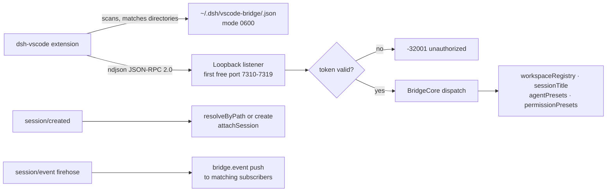

# dsh-vscode-bridge

[中文](README.md) | English

A plugin for [DeepSeek Harness](https://github.com/deepseek-ai/deepseek-harness) (DSH) that gives the [dsh-lite-vscode](https://github.com/EPCN-fla/dsh-lite-vscode) a narrow, token-authenticated JSON-RPC channel into native DSH services — workspace grouping, session titles, session archive, agent presets, permission presets, slash commands, the skill catalog, and session-log export.

The ACP surface is automation-only: titles, deletion, workspace grouping, presets, and permission modes never cross the ACP wire. With this plugin loaded, the extension talks to the harness's own services directly.

## Why

Sessions created over ACP never join the workspace registry, so the DSH Web UI files them under "ungrouped". Renaming or deleting a session, switching an agent preset, or flipping the permission mode all have native DSH services behind them — but nothing exposes those services to an external client.

This plugin closes that gap from inside the harness process: a loopback TCP listener with a bearer token discovered through a file the extension can actually find.

## Features

- **Workspace grouping fix**: every newly created session is attached to the workspace owning its cwd on `session/created` (creating the workspace when missing) — the "ungrouped" bucket stops filling up.
- **Native session titles**: read the folded title of any session, rename any live session through `sessionTitle.rename`.
- **Session delete**: product-level deletion through the registry-wide archive set (`workspaceRegistry.archiveSession`).
- **Agent presets**: list the roster with the effective default, read a session's composed preset, switch blank sessions (`agent-preset/locked` once a turn has run — upstream contract).
- **Permission presets**: query the option list plus a session's current preset, and switch it — sandbox mode and approval policy follow immediately.
- **Event push**: subscribed clients receive `bridge.event` notifications for plan/todo/title/permission/command-lifecycle session events, with exact or prefix (`plan/`, `command/`) type filters.
- **Native slash commands**: list the commands effective for a session (`/compact`, `/plan`, …) and run them through `ctx.commands.execute` — the exact path the TUI/Web composers take — with `command/run` / `command/done` lifecycle events riding the push channel.
- **Skill catalog**: read-only listing of project- and user-level skills (stable fields: name, description, source, …); actual invocation stays with the model-side skill tool, whose catalog is injected inside DSH.
- **Session-log export**: stream one session's logical log — subagent descendants and referenced attachments included — into a ZIP file on the host; archive bytes never cross the ndjson channel, so large logs stay memory-bounded.
- **Honest capabilities**: `bridge.handshake` reports what this deployment can actually do; a missing optional service degrades one method family, never the whole plugin.
- **Host version reporting**: the handshake and the discovery file carry `dshVersion` (the host DSH version, e.g. `0.1.7-rc.1`) so the extension can adapt to the host it connected to; the field is omitted — never guessed — when undetectable.

## How it works


```mermaid
flowchart LR
    Ext[dsh-vscode extension] -->|scans, matches directories| Disc[~/.dsh/vscode-bridge/<pid>.json<br/>mode 0600]
    Ext -->|ndjson JSON-RPC 2.0| Tcp[Loopback listener<br/>first free port 7310-7319]
    Tcp --> Auth{token valid?}
    Auth -->|no| Reject[-32001 unauthorized]
    Auth -->|yes| Core[BridgeCore dispatch]
    Core --> Svc[workspaceRegistry · sessionTitle<br/>agentPresets · permissionPresets]
    Created[session/created] --> Attach[resolveByPath or create<br/>attachSession]
    Fire[session/event firehose] --> Push[bridge.event push<br/>to matching subscribers]
```

1. The plugin binds the first free port in its configured range, so several harness processes (one per editor window) coexist without coordination.
2. It publishes `{ port, token, pid, protocolVersion, dshVersion?, capabilities, directories }` as `$HOME/.dsh/vscode-bridge/<pid>.json` (mode 0600, atomic write); `directories` lists the process cwd, every live session cwd, and every known workspace path so the extension can match its instance. The file is removed on unload, and stale entries are reaped on startup via pid liveness. Workspace directories are no longer written to.
3. Every request carries the token in a top-level `token` field; loopback plus file permissions are the whole access boundary.
4. WSL2's `localhostForwarding` lets a Windows-side extension reach a WSL-side listener transparently.

## Install

Requires deepseek-harness `0.1.7-rc.1` or `>=0.2.0-rc.1 <0.2.0` — each admitted version passed a source-level audit (see `docs/0.3.0-upgrade.md`); unlisted versions are unverified. 0.1.5 DSH leaves the support corridor with 0.3.0; 0.1.5 hosts should stay on plugin 0.2.x.

| Plugin version | Supported DSH versions |
| --- | --- |
| 0.3.0 | `0.1.7-rc.1 \|\| >=0.2.0-rc.1 <0.2.0` |
| 0.2.0 ~ 0.2.1 | `>=0.1.5-rc.2 <0.1.5 \|\| 0.1.7-rc.1` |
| 0.1.2 ~ 0.1.3 | `>=0.1.5-rc.2 <0.1.5` |

The plugin declares no DSH package in `peerDependencies`, so peer enforcement does not gate it — neither the 0.1.7 install/startup checks (DSH-0.1.7-J1-01) nor the composition-time compatibility preflight added in 0.2.0 (which disables rows whose declared `@deepseek-ai/dsh*` peers are unsatisfied; `dsh plugin allow-version` grants an exact-version exemption) looks at plugins without DSH peers.

The plugin must be loaded into a custom profile carrying both the `dsh-base` and `dsh-acp-app` bundles. DSH ships no ready-made acp profile: a custom profile initialized by `dsh plugin` starts with `dsh-base` only, so you add the `dsh-acp-app` bundle by hand, plus the service rows the ACP composition does not ship (`workspace`, the preset-registry row, and the subagent model-route host row the `standard` preset mounts). The preset-registry row is stable across the corridor: presets are declarative since 0.1.7 (DSH-0.1.7-J1-03) — the registry row is `agent-preset-registry` (`@deepseek-ai/dsh-agent-preset-registry`, `config: { default: standard }`) and each preset needs its own `@deepseek-ai/dsh-agent-preset` declaration row (see the web-app bundle's `presets/*.patch.yml`, byte-identical between 0.1.7 and 0.2.0). Without the service the bridge still loads; its `presets` capability reports unavailable.

All three options use the DSH CLI to add the plugin to a given profile (`acp-vscode` in the examples; substitute as needed).

### From npm

```sh
# A missing profile is initialized on the spot (with the dsh-base bundle only).
dsh plugin --profile acp-vscode add dsh-vscode-bridge
```

### From GitHub

```sh
dsh plugin --profile acp-vscode add github:EPCN-fla/dsh-vscode-bridge
```

When installed from a git source, pnpm runs the package's `prepare` script to build it automatically (requires Node `>=22`).

### From tarball

```sh
git clone https://github.com/EPCN-fla/dsh-vscode-bridge.git
cd dsh-vscode-bridge
pnpm install
pnpm run build
pnpm pack       # produces dsh-vscode-bridge-<version>.tgz
dsh plugin --profile acp-vscode add ./dsh-vscode-bridge-<version>.tgz
```

### Local development

Point the CLI at a working copy; rebuild after each change:

```sh
dsh plugin --profile acp-vscode add /absolute/path/to/dsh-vscode-bridge
```

### Wire up the profile

First add the ACP app to the bundle list in `$DSH_HOME/profiles/acp-vscode/package.json` (bundles ship with the CLI installation; nothing extra to download):

```json
{
  "dsh": {
    "profile": {
      "bundles": ["@deepseek-ai/dsh-base", "@deepseek-ai/dsh-acp-app"]
    }
  }
}
```

Then register the plugin and the missing service rows in `cordis.patch.yml` next to it. 0.1.7 and 0.2.0 hosts share one row set:

```yaml
# Insert the rows the ACP composition does not ship.
- insert:
    - id: workspace
      name: '@deepseek-ai/dsh-workspace'
    # Presets are declarative since 0.1.7 (DSH-0.1.7-J1-03): a registry row
    # plus one declaration row per preset.
    - id: agent-preset-registry
      name: '@deepseek-ai/dsh-agent-preset-registry'
      config:
        default: standard
    - id: subagent-model-selection-settings
      name: '@deepseek-ai/dsh-tool-subagent/model-selection-settings'
    - id: dsh-vscode-bridge
      name: 'dsh-vscode-bridge'
      # config: { portStart: 7310, portEnd: 7319 }   # optional overrides

# Preset declaration rows: copy the web-app bundle's
# presets/{standard,ptc,minimal,cordis}.patch.yml verbatim (the npm package's
# files field includes them; the extension's one-click install command
# writes them for you).
```

Never copy the 0.1.5-era `agent-presets` row from an old profile — the package was split and removed in 0.1.7 (DSH-0.1.7-J1-03); on any corridor host the row fails to import (entry-level failure), the `agentPresets` service goes missing, and the preset picker disappears. The extension's one-click install strips such legacy rows and adds the declaration rows (leaving a `.bak` backup).

The optional permission-metadata block below applies across the corridor:

```yaml
# Optional: add display names and descriptions to the three permission
# states (the base table carries only sandbox/approval, no name/description
# metadata).
- id: permission
  config:
    presets:
      read-only:
        sandbox: read-only
        approval: ask
        name: read-only
        description: Read-only; writes and wider retries require approval.
      workspace-write:
        sandbox: workspace-write
        approval: ask
        name: workspace-write
        description: Write inside the workspace; wider retries require approval.
      danger-full-access:
        sandbox: danger-full-access
        approval: never
        name: danger-full-access
        description: Full file access without approval prompts.
```

Finally point the extension at the profile by setting `dsh.profile` to `acp-vscode` (the extension's one-click install automates the whole sequence: it picks the row set matching the host's `dsh --version` — one declarative set covers 0.1.7 and 0.2.0 — and migrates profiles written by older installers); hand-writing the YAML is only recommended when you customize.

## Wire protocol

One JSON object per line, both directions, standard JSON-RPC 2.0 envelope.

```jsonc
// request
{ "jsonrpc": "2.0", "id": 1, "method": "session.setTitle",
  "params": { "sessionId": "…", "title": "Fix auth flow" }, "token": "…" }
// success
{ "jsonrpc": "2.0", "id": 1, "result": { "sessionId": "…", "title": "Fix auth flow", "updatedAt": 1700000000500 } }
// failure (data.code is stable machine-readable detail)
{ "jsonrpc": "2.0", "id": 1, "error": { "code": -32009, "message": "session \"…\" has already started; its agent preset is fixed",
  "data": { "code": "agent-preset/locked", "details": { } } } }
```

| Method | Params | Result |
|---|---|---|
| `bridge.handshake` | — | `{ protocolVersion, plugin, version, dshVersion?, pid, startedAt, capabilities }` — `dshVersion` is the host DSH version (e.g. `0.1.7-rc.1`), omitted when undetectable |
| `session.list` | `{ includeStored? }` | `{ sessions: LiveSessionInfo[], storedIncluded, stored? }` |
| `session.get` | `{ sessionId }` | live row, or a stored row with the folded title |
| `session.setTitle` | `{ sessionId, title }` | `{ sessionId, title, updatedAt }` — live sessions only |
| `session.delete` | `{ sessionId }` | `{ sessionId, archived: true }` — a session with live activity (a running turn) is refused with `-32009 session/active` (DSH ≥ 0.1.7); an unknown session with `-32004 session/not-found` |
| `session.subscribe` | `{ sessionId?, types? }` | `{ subscribed: true, types }`; events arrive as `bridge.event` notifications |
| `session.unsubscribe` | — | `{ subscribed: false }` |
| `preset.list` | — | `{ default, presets: [{ id, name?, description?, broken?, isDefault }] }` |
| `preset.current` | `{ sessionId }` | `{ sessionId, preset }` |
| `preset.select` | `{ sessionId, presetId }` | `{ sessionId, selected }`; fails with `agent-preset/locked` once the session has started |
| `permission.get` | `{ sessionId? }` | `{ options: [{ value, name, description? }], default, current? }` |
| `permission.set` | `{ sessionId, name }` | `{ sessionId, current }` |
| `workspace.list` | — | `{ workspaces: [{ id, path, title, sessionIds }], archivedSessionIds }` |
| `workspace.attach` | `{ sessionId }` | `{ attached, workspaceId?, reason? }` — live sessions attach directly; non-live sessions fall back to the stored header and attach by cwd (covers sessions created out-of-process, e.g. over ACP) |
| `command.list` | `{ sessionId }` | `{ commands: [{ name, description, inputHint?, attachments? }] }` — the native command catalog effective for that session's agent, sorted by name |
| `command.run` | `{ sessionId, line, timeoutMs? }` | `{ commandId, kind: 'success' \| 'error', text?, sourceEventSeq? }` — `line` must start with `/`; handler-level failure arrives as `kind:'error'` with text, never as an RPC error |
| `skill.list` | `{ sessionId? }` | `{ skills: [{ name, description, whenToUse?, source, provider }] }` — with `sessionId`, project-level skills resolve against the session header cwd, otherwise the process cwd; an empty catalog is not an error |
| `session.exportZip` | `{ sessionId, destPath? }` | `{ path, fileName, bytes, entries }` — writes the session-log ZIP (subagent descendants included) to `destPath` (default `<tmpdir>/dsh-session-export/<fileName>`); live sessions are flushed through the durability barrier first |

Subscription `types` entries match exactly, or by prefix when they end in `/` (`plan/` matches `plan/update`); `*` matches everything. The default push set is `session/title`, `permission/preset`, `sandbox/mode`, `approval/policy`, `agent-preset/selected`, `command/`, `plan/`, `todo/`.

Error codes: standard JSON-RPC (`-32700` parse, `-32600` invalid request, `-32601` unknown method, `-32602` invalid params, `-32603` internal) plus `-32000` server error (`data.code` such as `command/timeout`, `command/aborted`), `-32001` unauthorized (bad/missing token), `-32002` service unavailable in this profile, `-32004` session not found / not live, `-32009` conflict (carries upstream codes such as `agent-preset/locked` in `data.code`). An unresolvable `command.run` name additionally answers `-32602` with `data.code: 'command/unknown'`.

## Configuration

| Key | Default | Meaning |
|---|---|---|
| `host` | `127.0.0.1` | Bind address. Keep loopback — the discovery-file token is the access boundary. |
| `portStart` / `portEnd` | `7310` / `7319` | Candidate port range; the first free port wins. |
| `token` | random per boot | Fixed bearer token, when reproducibility matters more than hygiene. |
| `discoveryDir` | `$HOME/.dsh/vscode-bridge` | Discovery directory holding `<pid>.json`. |
| `attachSessions` | `true` | Attach new sessions to their cwd's workspace on `session/created`. |
| `commandTimeoutMs` | `180000` | `command.run` execution timeout; the in-flight command aborts past it and the RPC answers `command/timeout` (compact needs one LLM summarization, hence the generous default). |

## Known limitations

- **Rename and permission/preset switches require a live session.** A stored (not running) session must be resumed through ACP first; stored titles remain readable via `session.get`.
- **"Delete" is archive**: the session disappears from every grouping surface, but its event log stays on disk. Physical deletion is not a public DSH API.
- **Preset switching is blank-session only** (the upstream `agent-preset/locked` contract): once a turn has run, the composition is fixed.
- **`agentPresets` is optional.** With the preset-registration rows missing (the `agent-preset-registry` row plus the declaration rows) the plugin still loads; `preset.*` then answers `service-unavailable` and the handshake reports `presets: false`.
- **`dshVersion` depends on detectable install facts.** Tried in order: the launcher-provided `profileContext.installAnchor` (every corridor host provides it), the CLI entry in `process.argv[1]` (covers launches without a `profileContext`), then module resolution from the plugin's own location (development checkouts). When none applies (custom compositions, some packaged hosts) the field is absent — clients must treat it as optional and never assume a default.
- **`commands`/`skills`/`sessionExport` are optional too.** When the ACP composition lacks the service rows the plugin still loads, the affected method family answers `service-unavailable`, and the handshake reports the flag as `false`; the archive module is only resolved lazily on first use, so an unresolvable module never affects plugin load.
- **Export does not go through the Web `/export` command.** That command needs the `connection` service the ACP composition does not mount; the bridge bypasses the command layer, reuses the archive module directly, and has `session.exportZip` produce the ZIP file on the host (descendant logs included) without streaming bytes over ndjson.
- **`command.run` is live-session only and attachment-free.** ACP has no staged-receipt channel, so attachments are always submitted empty; when a command declares it needs them, the upstream error text passes through verbatim as a `kind:'error'` result. Busy sessions are not pre-checked: compact reports `busy` itself, plan answers `queued`.
- **`skill.list` is a read-only catalog.** Skills are actually invoked by the model-side skill tool (whose catalog is injected inside DSH); the bridge never triggers a skill on the model's behalf.
- **Topology 3 (WSL extension host → Windows-hosted dsh) is out of scope** for the TCP channel: a Windows process does not publish a discovery file a WSL client can act on, and loopback does not cross that direction.
- **Multiple instances on one machine coexist** via their own `<pid>.json` entries; when several entries match one folder, the extension picks the newest `startedAt`.

## Development

Requires Node `>=22` (engines; CI runs the full suite on both 22 and 24). Running the type-stripped TS tests directly (`node --test`) additionally needs ≥ `22.18` or ≥ `23.6` (unflagged type stripping), which the latest 22.x CI resolves to satisfies out of the box.

```sh
pnpm install
pnpm run typecheck   # tsc --noEmit
pnpm run test        # node:test over type-stripped TS
pnpm run build       # emit lib/ + lib/types/
```

All tests live in `tests/`:

| File | Coverage |
|---|---|
| `tests/server.test.ts` | Port scanning, ndjson framing, line-limit disconnect, listener lifecycle |
| `tests/discovery.test.ts` | Publish/replace/clear of the mode-0600 discovery file, dead-pid stale sweep, unwritable directories |
| `tests/core.test.ts` | Token auth, every RPC method against mocked services, upstream error-code passthrough, event push filtering, degraded-service capabilities, `dshVersion` presence/omission on handshake and discovery |
| `tests/host-version.test.ts` | Host-version detection: anchor direct read, anchor-relative resolution (CLI / cohort witness), the argv fallback, source priority, honest absence (resolution jailed to throwaway trees, immune to the machine's own node_modules) |
| `tests/compose.test.ts` | Real Cordis composition: plugin load → discovery file → TCP handshake (`dshVersion` end to end) → RPC → clean unload |

### Directory structure

```
src/
  index.ts        plugin entry (name/inject/Config/apply, Cordis wiring)
  core.ts         BridgeCore: attach logic, RPC dispatch, event push
  host-version.ts host DSH version detection (profileContext anchor → CLI entry → local resolution)
  server.ts       ndjson JSON-RPC/TCP transport with port-range scanning
  discovery.ts    <pid>.json discovery publish/retract (atomic, mode 0600, stale sweep)
  protocol.ts     wire types, error codes, capability flags
tests/            node:test suites (type-stripped TS)
```

The plugin follows the Harness function-plugin contract: named exports `name` / `inject` / `Config` / `apply`, no default export.

## License

[MIT](LICENSE)
