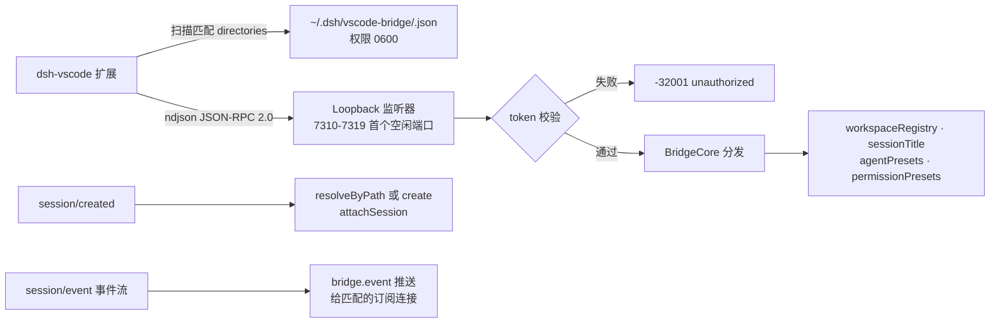

# dsh-vscode-bridge

中文 | [English](README.en.md)

适用于 [DeepSeek Harness](https://github.com/deepseek-ai/deepseek-harness)（DSH）的插件：为 [dsh-vscode-lite](https://github.com/EPCN-fla/dsh-vscode-lite) 提供一条窄带、令牌鉴权的 JSON-RPC 通道，直通 DSH 原生服务——工作区分组、会话标题、会话删除、Agent 预设、权限预设。

ACP 是纯自动化接口，标题、删除、工作区分组、预设、权限模式都不会出现在 ACP 协议上。装载本插件后，扩展可以直接调用 DSH 进程内的原生服务。

## 为什么需要

通过 ACP 创建的会话从不加入 workspace registry，因此在 DSH Web UI 里全部落入「未分组」。而重命名/删除会话、切换 Agent 预设、切换权限模式，在 DSH 内部都有原生服务——只是没有任何通道把这些服务暴露给外部客户端。

本插件从 DSH 进程内部补上这个缺口：一个 loopback TCP 监听器，持令牌鉴权，扩展通过发现文件找到它。

## 特性

- **工作区分组修复**：在 `session/created` 时把每个新会话 attach 到其 cwd 所属的工作区（不存在则创建）——「未分组」不再增长。
- **原生会话标题**：读取任意会话折叠后的标题；通过 `sessionTitle.rename` 重命名任意活会话。
- **会话删除**：经 registry 级归档集合实现产品级删除（`workspaceRegistry.archiveSession`）。
- **Agent 预设**：列出预设名册（含生效的默认项）、读取会话当前预设、切换空白会话（会话开跑后返回 `agent-preset/locked`——上游契约）。
- **权限预设**：查询选项列表与会话当前预设并切换——sandbox 模式与 approval 策略立即生效。
- **事件推送**：订阅方收到 plan/todo/标题/权限等会话事件的 `bridge.event` 通知，类型过滤支持精确匹配与前缀匹配（`plan/`）。
- **能力如实上报**：`bridge.handshake` 报告当前部署真实可用的能力；某个可选服务缺失只降级对应方法族，插件整体不受影响。

## 工作原理



1. 插件绑定配置区间内第一个空闲端口，多个 DSH 进程（每个编辑器窗口一个）无需协调即可共存。
2. 插件把 `{ port, token, pid, protocolVersion, capabilities, directories }` 写入 `$HOME/.dsh/vscode-bridge/<pid>.json`（0600，原子写），`directories` 列出进程 cwd、每个活会话 cwd 和每个已知工作区路径供扩展匹配实例；卸载时删除，启动时按 pid 活性回收历史残留。工作区目录不再被写入。
3. 每个请求都必须在顶层 `token` 字段携带令牌；loopback + 文件权限就是全部访问边界。
4. 借助 WSL2 的 `localhostForwarding`，Windows 侧的扩展可以透明地连上 WSL 侧的监听器。

## 安装

要求 deepseek-harness **0.1.5-rc.2**（`@deepseek-ai/dsh-*` 包 ≥ 0.1.5-rc.2）。

插件要装进一个同时携带 `dsh-base` 与 `dsh-acp-app` 两个 bundle 的自建 profile。DSH 默认不带现成的 acp profile：`dsh plugin` 初始化出的自建 profile 只有 `dsh-base`，需要手动补上 `dsh-acp-app` bundle，以及 ACP 组合没有的几行服务（`workspace`、`agent-presets`，外加 `standard` 预设挂载所需的子代理模型路由宿主行）。

### 从 npm 安装

```sh
# profile 不存在时自动初始化（初始仅含 dsh-base bundle）
dsh plugin --profile acp-vscode add dsh-vscode-bridge
```

### 从 tarball 安装

```sh
git clone https://github.com/EPCN-fla/dsh-vscode-bridge.git
cd dsh-vscode-bridge
pnpm install
pnpm run build
pnpm pack       # 产出 dsh-vscode-bridge-<version>.tgz
dsh plugin --profile acp-vscode add ./dsh-vscode-bridge-<version>.tgz
```

### 本地开发

开发期把 CLI 直接指向工作副本目录，每次改动后重新构建：

```sh
dsh plugin --profile acp-vscode add /absolute/path/to/dsh-vscode-bridge
```

### 接线 profile

先把 `$DSH_HOME/profiles/acp-vscode/package.json` 的 bundle 列表补上 ACP 应用（bundle 随 CLI 安装自带，无需另装依赖）：

```json
{
  "dsh": {
    "profile": {
      "bundles": ["@deepseek-ai/dsh-base", "@deepseek-ai/dsh-acp-app"]
    }
  }
}
```

再在同目录的 `cordis.patch.yml` 中注册插件与缺失的服务行：

```yaml
# 插入 acp 组合未携带的服务行
- insert:
    - id: workspace
      name: '@deepseek-ai/dsh-workspace'
    - id: agent-presets
      name: '@deepseek-ai/dsh-agent-presets'
      config:
        default: standard
    # standard 预设的子代理模型路由读这个宿主行（web bundle 自带，acp 组合没有）
    - id: subagent-model-selection-settings
      name: '@deepseek-ai/dsh-tool-subagent/model-selection-settings'
    - id: dsh-vscode-bridge
      name: 'dsh-vscode-bridge'
      # config: { portStart: 7310, portEnd: 7319 }   # 可选覆盖

# 可选：为三档权限补上显示名与描述（base 的默认表只有 sandbox/approval，
# 没有 name/description 元数据）
- id: permission
  config:
    presets:
      read-only:
        sandbox: read-only
        approval: ask
        name: read-only
        description: 只读；写入与更大范围的重试需要批准。
      workspace-write:
        sandbox: workspace-write
        approval: ask
        name: workspace-write
        description: 允许在工作区内写入；更大范围的重试需要批准。
      danger-full-access:
        sandbox: danger-full-access
        approval: never
        name: danger-full-access
        description: 完全文件访问，不再弹出批准。
```

最后把扩展的 `dsh.profile` 设置为 `acp-vscode`（扩展的「一键安装 bridge」命令会自动完成上述全部步骤）。

## 通信协议

双向均为每行一个 JSON 对象，标准 JSON-RPC 2.0 信封。

```jsonc
// 请求
{ "jsonrpc": "2.0", "id": 1, "method": "session.setTitle",
  "params": { "sessionId": "…", "title": "修复登录流程" }, "token": "…" }
// 成功
{ "jsonrpc": "2.0", "id": 1, "result": { "sessionId": "…", "title": "修复登录流程", "updatedAt": 1700000000500 } }
// 失败（data.code 是稳定的机器可读细节）
{ "jsonrpc": "2.0", "id": 1, "error": { "code": -32009, "message": "session \"…\" has already started; its agent preset is fixed",
  "data": { "code": "agent-preset/locked", "details": { } } } }
```

| 方法 | 参数 | 返回 |
|---|---|---|
| `bridge.handshake` | — | `{ protocolVersion, plugin, version, pid, startedAt, capabilities }` |
| `session.list` | `{ includeStored? }` | `{ sessions: LiveSessionInfo[], storedIncluded, stored? }` |
| `session.get` | `{ sessionId }` | 活会话行，或带折叠标题的存储态行 |
| `session.setTitle` | `{ sessionId, title }` | `{ sessionId, title, updatedAt }`——仅限活会话 |
| `session.delete` | `{ sessionId }` | `{ sessionId, archived: true }` |
| `session.subscribe` | `{ sessionId?, types? }` | `{ subscribed: true, types }`；事件以 `bridge.event` 通知到达 |
| `session.unsubscribe` | — | `{ subscribed: false }` |
| `preset.list` | — | `{ default, presets: [{ id, trust, name?, description?, broken?, isDefault }] }` |
| `preset.current` | `{ sessionId }` | `{ sessionId, preset }` |
| `preset.select` | `{ sessionId, presetId }` | `{ sessionId, selected }`；会话开跑后以 `agent-preset/locked` 失败 |
| `permission.get` | `{ sessionId? }` | `{ options: [{ value, name, description? }], default, current? }` |
| `permission.set` | `{ sessionId, name }` | `{ sessionId, current }` |
| `workspace.list` | — | `{ workspaces: [{ id, path, title, sessionIds }], archivedSessionIds }` |
| `workspace.attach` | `{ sessionId }` | `{ attached, workspaceId?, reason? }`——活会话直接挂载；非活会话回退到存储态头按 cwd 校验挂载（覆盖 ACP 等进程外创建的会话） |

订阅的 `types` 条目默认精确匹配；以 `/` 结尾时按前缀匹配（`plan/` 匹配 `plan/update`）；`*` 匹配全部。默认推送集合：`session/title`、`permission/preset`、`sandbox/mode`、`approval/policy`、`agent-preset/selected`、`plan/`、`todo/`。

错误码：标准 JSON-RPC（`-32700` 解析失败、`-32600` 非法请求、`-32601` 未知方法、`-32602` 参数错误、`-32603` 内部错误），另有 `-32001` 未授权（token 缺失或错误）、`-32002` 该 profile 中服务不可用、`-32004` 会话不存在/非活会话、`-32009` 冲突（`data.code` 携带上游错误码，如 `agent-preset/locked`）。

## 配置

| 配置 | 默认 | 含义 |
|---|---|---|
| `host` | `127.0.0.1` | 绑定地址。保持 loopback——发现文件令牌就是访问边界 |
| `portStart` / `portEnd` | `7310` / `7319` | 候选端口区间；第一个空闲端口胜出 |
| `token` | 每次启动随机 | 固定令牌，需要可复现性多于卫生性时使用 |
| `discoveryDir` | `$HOME/.dsh/vscode-bridge` | 发现目录，内含 `<pid>.json` |
| `attachSessions` | `true` | 在 `session/created` 时把新会话 attach 到其 cwd 的工作区 |

## 已知限制

- **重命名与权限/预设切换要求活会话**。存储态（未运行）会话需先经 ACP resume；存储态标题仍可通过 `session.get` 读取。
- **「删除」即归档**：会话从所有分组界面消失，但其事件日志仍保留在磁盘上。物理删除不是 DSH 的公开 API。
- **预设切换仅限空白会话**（上游 `agent-preset/locked` 契约）：跑过一轮后组合即固定。
- **`agentPresets` 是可选服务**。缺少 `agent-presets` patch 行时插件照常加载；此时 `preset.*` 返回 `service-unavailable`，握手如实报告 `presets: false`。
- **拓扑 3（WSL 扩展宿主 → Windows 侧 dsh）不在 TCP 通道覆盖范围内**：Windows 进程发布的发现文件对 WSL 客户端不可达，该方向上 loopback 也不互通。
- **同机多实例按 `<pid>.json` 共存**，共用同一工作区目录的多个 DSH 进程各自发布条目；扩展在该目录的匹配条目中取 `startedAt` 最新者。

## 开发

要求 Node `>=20`（在 Node 24 上开发）。

```sh
pnpm install
pnpm run typecheck   # tsc --noEmit
pnpm run test        # node:test（type-stripped TS）
pnpm run build       # 产出 lib/ 与 lib/types/
```

测试全部位于 `tests/`：

| 文件 | 覆盖 |
|---|---|
| `tests/server.test.ts` | 端口扫描、ndjson 分帧、超长行断连、监听器生命周期 |
| `tests/discovery.test.ts` | 0600 发现文件的发布/替换/清理、死 pid 残留清扫、不可写目录 |
| `tests/core.test.ts` | token 鉴权、全部 RPC 方法（mock 服务）、上游错误码透传、事件推送过滤、服务降级时的能力上报 |
| `tests/compose.test.ts` | 真实 Cordis 组合：插件加载 → 发现文件 → TCP 握手 → RPC → 干净卸载 |

### 目录结构

```
src/
  index.ts        插件入口（name/inject/Config/apply，Cordis 接线）
  core.ts         BridgeCore：attach 逻辑、RPC 分发、事件推送
  server.ts       ndjson JSON-RPC/TCP 传输层（端口区间扫描）
  discovery.ts    <pid>.json 发现文件的发布与回收（原子写，0600，残留清扫）
  protocol.ts     协议类型、错误码、能力标志
tests/            node:test 测试（type-stripped TS）
```

本插件遵循 Harness function-plugin 契约：named exports `name` / `inject` / `Config` / `apply`，无 default export。

## 许可证

[MIT](LICENSE)
